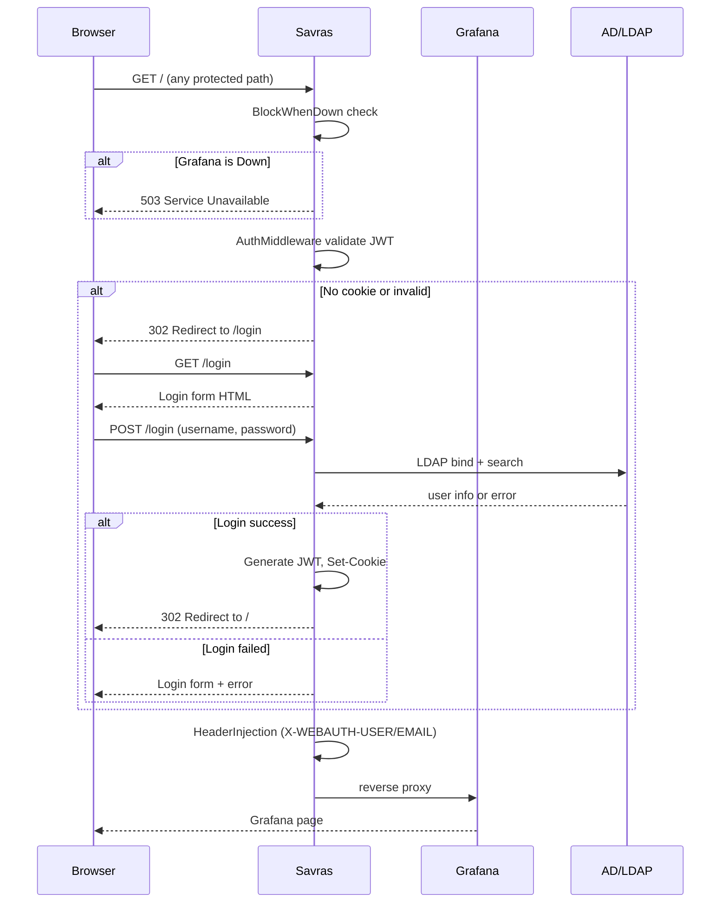
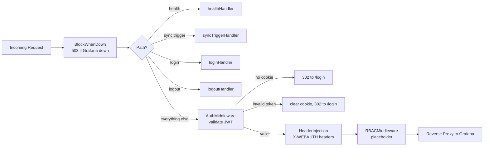
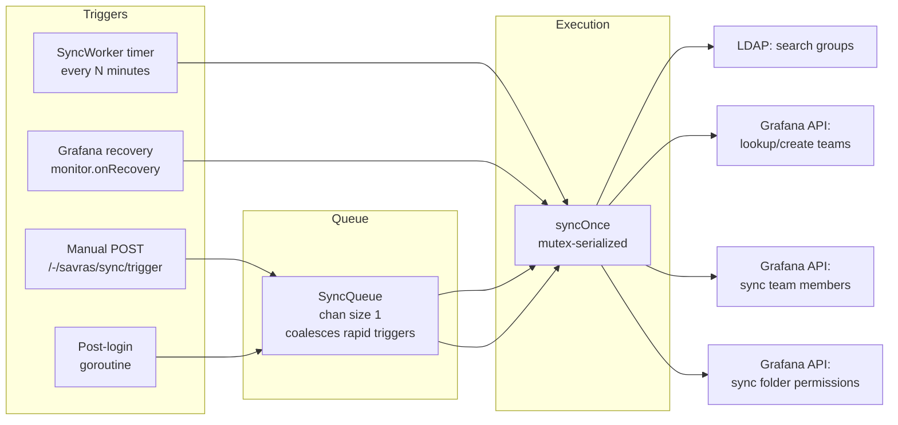

# Savras - Grafana Auth Proxy & Sync Sidecar


[](https://codecov.io/gh/magichuihui/savras)

Savras is a Grafana authentication proxy and organization sync tool that runs as a sidecar.

## Architecture


### Request Flow



### Middleware Chain



### Grafana Lifecycle Monitor

```mermaid
stateDiagram-v2
    [*] --> Up
    Up --> Down: proxy error or health probe fail
    Down --> Up: exponential backoff probe succeeds

    state Up {
        [*] --> Serving
        Serving --> ProbeBG: every 30s GET /api/health
        ProbeBG --> Serving: 2xx
        ProbeBG --> Down: error
    }

    state Down {
        [*] --> Blocked
        Blocked --> Probing: backoff 1s->10s + jitter
        Probing --> Recovered: /api/health 2xx
        Probing --> Probing: retry
        Recovered --> Up: callback: sync + invalidate tokens
    }
```

### Sync Triggers



## Features

- Active Directory LDAP authentication
- JWT token issuance and validation (RSA or HMAC)
- Dynamic header injection (X-WEBAUTH-USER, X-WEBAUTH-EMAIL)
- Reverse proxy to Grafana with auth middleware
- Auto-detection of Grafana restart → invalidate all tokens, block traffic until sync completes
- Periodic AD group to Grafana team synchronization
- Folder permission assignment based on team mappings
- Health check endpoint (`/-/savras/health`)
- Manual sync trigger endpoint (`POST /-/savras/sync/trigger`)

## Quick Start

```bash
# 1. Configure
cp config.example.yaml config.yaml
# edit config.yaml with your LDAP/Grafana settings

# 2. Run directly
make run

# 3. Login at http://localhost:8080
# Grafana must be configured to use auth proxy with headers
```

## Building

```bash
# Build for current platform
make build

# Cross-compile for Linux (amd64 + arm64)
make build-all

# Or use Go directly
go build -o savras ./cmd/savras
```

## Configuration

See config.example.yaml for all options. Key settings:
- LDAP server connection
- Grafana API credentials
- JWT secret for token signing
- Sync interval and group mappings
- Folder permissions: assign folder access to teams with specific permission levels

Sensitive fields (passwords, tokens, keys) can be overridden via environment variables,
which is useful when deploying with Kubernetes Secrets:

```bash
export SAVRAS_LDAP_BIND_PASSWORD=secret
export SAVRAS_GRAFANA_ADMIN_PASSWORD=admin
export SAVRAS_AUTH_JWT_SECRET=my-jwt-secret
make run
```

| Environment Variable | Overrides |
|---|---|
| `SAVRAS_LDAP_BIND_PASSWORD` | `ldap.bind_password` |
| `SAVRAS_GRAFANA_ADMIN_PASSWORD` | `grafana.admin_password` |
| `SAVRAS_GRAFANA_API_TOKEN` | `grafana.api_token` |
| `SAVRAS_AUTH_JWT_SECRET` | `auth.jwt_secret` |
| `SAVRAS_AUTH_JWT_PRIVATE_KEY` | `auth.jwt_private_key` |
| `SAVRAS_AUTH_LOCAL_ADMIN_PASSWORD` | `auth.local_admin_password` |

Env vars take precedence over values in config.yaml.

## Endpoints

- `/-/savras/health` - Health check
- `POST /-/savras/sync/trigger` - Manual sync trigger
- All other routes proxied to Grafana with auth

## Docker

### Build Locally

```bash
make docker-build
docker run -v $(pwd)/config.yaml:/etc/savras/config.yaml -p 8080:8080 savras
```

### Multi-arch Build

```bash
make docker-buildx
```

### GitHub Container Registry

Published automatically on every release (`v*` tag push):

```bash
docker pull ghcr.io/magichuihui/savras:v0.0.1
```

Images are multi-arch (linux/amd64, linux/arm64) and tagged with the full version
and major.minor (e.g. `v0.0.1`, `v0.0`).

## Development

```bash
make fmt      # format code
make vet      # static analysis
make test     # run all tests with race detector
make test-cover  # coverage report
make lint     # staticcheck
make tidy     # tidy go modules
make clean    # remove build artifacts
```

## Release

Releases are automated via GitHub Actions. Push a tag to trigger:

```bash
git tag v0.1.0
git push origin v0.1.0
```

This builds binaries for all platforms (linux/darwin/windows, amd64/arm64),
uploads them to the GitHub Release, and publishes a multi-arch Docker image
to `ghcr.io/magichuihui/savras`.
