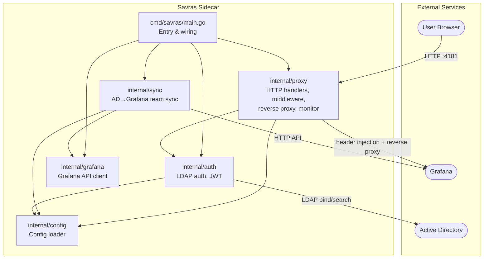
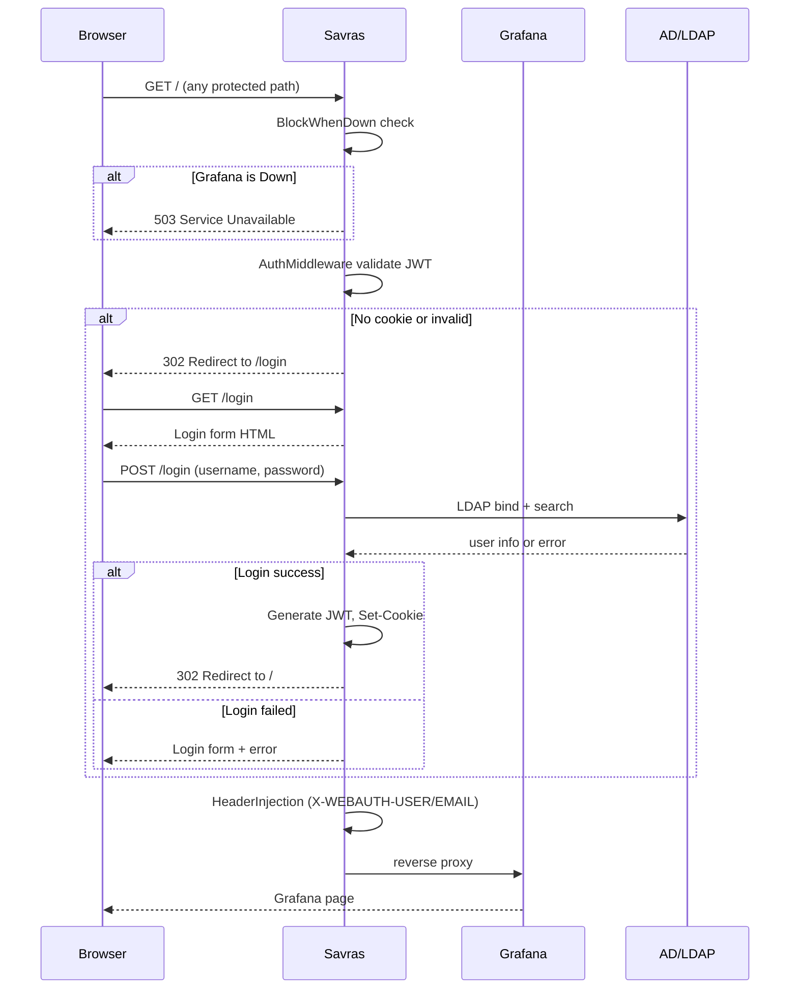

# Savras - Grafana Auth Proxy & Sync Sidecar


[](https://codecov.io/gh/magichuihui/savras)

Savras is a Grafana authentication proxy and organization sync tool that runs as a sidecar.

## Architecture



### Request Flow



## Features

- Active Directory LDAP authentication
- JWT token issuance and validation (RSA or HMAC)
- Dynamic header injection (X-WEBAUTH-USER, X-WEBAUTH-EMAIL)
- Reverse proxy to Grafana with auth middleware
- Auto-detection of Grafana restart → invalidate all tokens, block traffic until sync completes
- Periodic AD group to Grafana team synchronization
- Folder permission assignment based on team mappings
- Health check endpoint (`/-/savras/health`)
- Manual sync trigger endpoint (`POST /-/savras/sync/trigger`)

## Quick Start

```bash
# 1. Configure
cp config.example.yaml config.yaml
# edit config.yaml with your LDAP/Grafana settings

# 2. Run directly
make run

# 3. Login at http://localhost:4181
# Grafana must be configured to use auth proxy with headers
```

## Testing & Local Development

### Test LDAP (Kubernetes)

Deploy OpenLDAP with test users matching `config.example.yaml`:

```bash
kubectl apply -f samples/openldap/ldap.yaml
```

This creates in the `monitoring` namespace:

| Resource | Name | Purpose |
|---|---|---|
| **ConfigMap** | `ldap-seed` | LDIF bootstrap data (users & groups) |
| **Deployment** | `openldap` | OpenLDAP server (osixia/openldap) |
| **Service** | `openldap` | Exposes port 389 within the cluster |

**Test credentials:**

| User | Password | LDAP Group | Grafana Team |
|---|---|---|---|---|
| `testuser` | `testpass` | devops | devops (Admin) |
| `jane` | `janepass` | developer | developer (Edit) |
| `admin` | `admin` | devops (hardcoded) | devops (Admin, no LDAP needed) |

The LDAP server matches `config.example.yaml` settings:

| Config Key | Value |
|---|---|
| `ldap.host` | `openldap.monitoring.svc.cluster.local` |
| `ldap.port` | `389` |
| `ldap.bind_dn` | `cn=admin,dc=example,dc=com` |
| `ldap.bind_password` | `ldap-password` |
| `ldap.base_dn` | `ou=people,dc=example,dc=com` |
| `ldap.group_base_dn` | `ou=groups,dc=example,dc=com` |

> **Tip:** For local development without a cluster, run Savras with `make run` and update `config.yaml` to point `ldap.host` at a reachable LDAP server.

### Kubernetes / Helm

All-in-one deployment with OpenLDAP, Savras ConfigMap, and Grafana:

```bash
# Full automated deployment (OpenLDAP + Savras ConfigMap + Grafana + Savras sidecar)
./samples/grafana/install.sh

# Or step by step:
# 1. Deploy OpenLDAP
kubectl apply -f samples/openldap/ldap.yaml

# 2. Create Savras ConfigMap
kubectl apply -f samples/grafana/configmap.yaml

# 3. Deploy Grafana with Helm (auth proxy pre-configured)
helm upgrade --install grafana grafana/grafana \
  --namespace monitoring --create-namespace \
  --values samples/grafana/values.yaml
```

The `samples/grafana/values.yaml` configures:
- Auth proxy mode with `X-WEBAUTH-USER` / `X-WEBAUTH-EMAIL` headers
- Auto sign-up so LDAP users are created in Grafana on first login
- Dashboard sidecar for configmap-based provisioning
- Post-start lifecycle hook that triggers an initial sync after Grafana starts

### Testing the Full Flow

Once the stack is running, verify end-to-end:

```bash
# 1. Health check — should return 200
curl -s http://localhost:4181/-/savras/health | jq .

# 2. Login as testuser (LDAP auth)
curl -s -v -X POST http://localhost:4181/login \
  -d "username=testuser&password=testpass" \
  -c /tmp/savras-cookies.txt 2>&1 | grep -E "(Location|Set-Cookie)"

# 3. Access Grafana through Savras with the cookie
curl -s -o /dev/null -w "%{http_code}" http://localhost:4181/ \
  -b /tmp/savras-cookies.txt
# Should return 200 or 302 (Grafana redirect)

# 4. Trigger a sync (if sync is enabled)
curl -s -X POST http://localhost:4181/-/savras/sync/trigger

# 5. Logout
curl -s -v http://localhost:4181/logout -c /tmp/savras-cookies.txt 2>&1
```

Or open `http://localhost:4181` in a browser — you should see the Grafana login page styled by Savras. Log in with `testuser` / `testpass` to be proxied into Grafana as an admin.

## Building

```bash
# Build for current platform
make build

# Cross-compile for Linux (amd64 + arm64)
make build-all

# Docker image
make docker-build

# Multi-arch Docker image
make docker-buildx

# Or use Go directly
go build -o savras ./cmd/savras
```

## Configuration

See `config.example.yaml` for all options. Key sections:

- **`server`** — listen address and Grafana backend URL
- **`auth`** — JWT secret/expiry, cookie settings, admin credentials (used for both LDAP bypass and Grafana API auth)
- **`ldap`** — LDAP server connection, bind credentials, search filters
- **`sync`** — sync interval, group mappings, folder permissions

Sensitive fields (passwords, tokens, keys) can be overridden via environment variables,
which is useful when deploying with Kubernetes Secrets:

```bash
export SAVRAS_LDAP_BIND_PASSWORD=secret
export SAVRAS_AUTH_LOCAL_ADMIN_PASSWORD=admin
export SAVRAS_AUTH_JWT_SECRET=my-jwt-secret
make run
```

| Environment Variable | Overrides |
|---|---|
| `SAVRAS_LDAP_BIND_PASSWORD` | `ldap.bind_password` |
| `SAVRAS_AUTH_JWT_SECRET` | `auth.jwt_secret` |
| `SAVRAS_AUTH_JWT_PRIVATE_KEY` | `auth.jwt_private_key` |
| `SAVRAS_AUTH_LOCAL_ADMIN_PASSWORD` | `auth.local_admin_password` |
| `SAVRAS_GRAFANA_API_TOKEN` | `auth.grafana_api_token` |

Env vars take precedence over values in config.yaml.

## Endpoints

| Path | Method | Purpose |
|---|---|---|
| `/-/savras/health` | GET | Health check — reflects LDAP + Grafana connectivity |
| `/-/savras/sync/trigger` | POST | Trigger an AD-to-Grafana team sync |
| `/-/savras/logout` | GET | Clear Savras session cookie |
| `/login` | GET/POST | Login form (GET) and LDAP auth (POST) |
| `/logout` | GET | Grafana logout — clears Savras cookie + proxies to Grafana |
| `/api/auth/logout` | GET | Same as above (Grafana API logout path) |
| `/` (all other routes) | * | Proxied to Grafana with auth + header injection |

## Docker

### GitHub Container Registry

Published automatically on every release (`v*` tag push):

```bash
docker pull ghcr.io/magichuihui/savras:v0.1.1
```

Images are multi-arch (linux/amd64, linux/arm64) and tagged with the full version
and major.minor (e.g. `v0.1.1`, `v0.1`).

## Development

```bash
make fmt         # format code
make vet         # static analysis
make test        # run all tests with race detector
make test-cover  # coverage report
make lint        # staticcheck
make tidy        # tidy go modules
make clean       # remove build artifacts
```

## Release

Releases are automated via GitHub Actions. Push a tag to trigger:

```bash
git tag v0.1.0
git push origin v0.1.0
```

This builds binaries for all platforms (linux/darwin/windows, amd64/arm64),
uploads them to the GitHub Release, and publishes a multi-arch Docker image
to `ghcr.io/magichuihui/savras`. See `.github/workflows/release.yml` for details.
